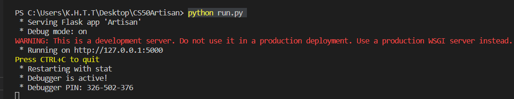

# Aspiration to Artisan
**Aspiration to Artisan** is a handmade blog :yarn::thread: developing as a web application :iphone:. The aim of **Artisan** is to make it easy to learn and search for handicraft things and to make people more interested in handmade things.

#### Video Demo: https://youtu.be/N5haiRqlFmw
## Description
The meaning of website name, *the Aspiration to Artisan* is that lets decorate the wonderful world :earth_asia: with the imagination and desire of artisans:standing_man: by doing what they loved.So I decided to create a web application that can read blogs from different users :boy::girl: and can also create a blog post by themselves to share their ideas about handicrafts and the DIY things that everyone can do at home.Besides, this is my final project for CS50's Introduction to Computer Science.

## Built with what? :hammer_and_wrench:
- Python 3.11.0
* Flask 2.2.2
+ Flask-SQLALCHEMY 3.0.2
- HTML 
* CSS
+ BOOTSTRAP 5.2
- Jinja2 3.1.2

## What can we Do? :monocle_face:
For Register User:
+ Can read Blog Post by other users :heavy_check_mark:
+ Can create their own Posts :heavy_check_mark:
+ Can Edit their post if they want to make changes or add something :heavy_check_mark:
+ Can delete their post if they don't want :heavy_check_mark:

For Unregister User:
- Can read Blog Post by other users :heavy_check_mark:

## Installation and How to Run 
If you are familiar with Github, you can download this project by git clone.

**1. Open Git Bash and clone the project to the location where you want**

```
$ git clone https://github.com/Khant-haythi/CS50Artisan.git
```
**2. Then use your favourite IDE to open this clone folder . I prefer vs code.**

**3. Next, choose**
```
New Terminal from Terminal tag
```
**4. When the terminal is open , you can run the project by writing**
```
python run.py
```
**5. Finally, to see the Aspiration to Artisan website , (Crtl + click) over**
```
 http://127.0.0.1:5000
```



